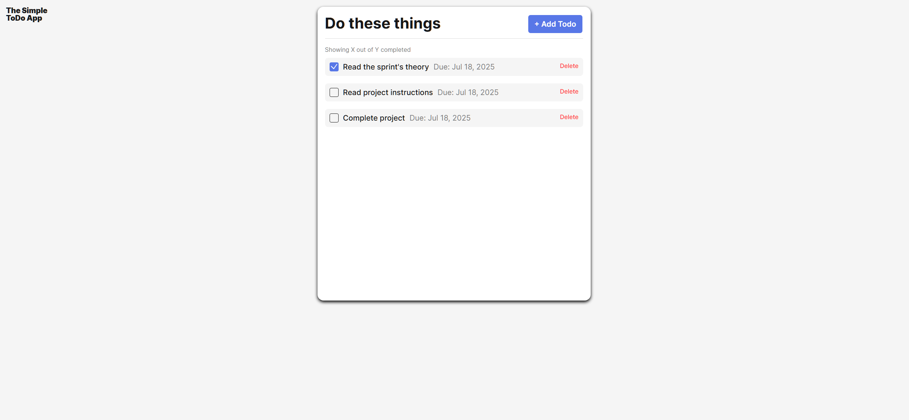

# Simple Todo App

This is a clean and responsive todo list application built using vanilla JavaScript and object-oriented programming. Users can view hardcoded tasks, add new ones through a modal form, and mark them as completed or delete them. The app was refactored to follow OOP principles and uses JS modules to organize functionality.

## Functionality

- View a list of initial todos loaded on page start
- Add new todo items via a popup form
- Each todo includes a name and optional due date
- Mark tasks as completed with a checkbox
- Delete individual todo cards
- Real-time client-side form validation
- Modal automatically clears validation on successful submit

## Technology

- **HTML5, CSS3**
- **Vanilla JavaScript (ES6+)**
- **Object-Oriented Programming** (`Todo` and `FormValidator` classes)
- **JavaScript Modules** for code organization
- **UUID** library for generating unique IDs
- **Live Server** used for local development (for module support)

## Deployment

This project is deployed on GitHub Pages:

- [ View the Live App]()
